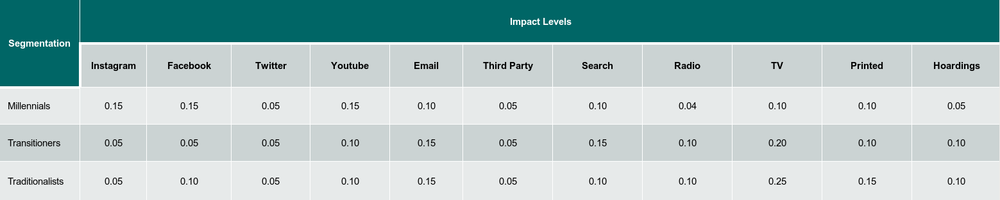

```{r setup, include=FALSE}
knitr::opts_chunk$set(echo = TRUE)
```
```{r message=FALSE, warning=FALSE, include=FALSE, results='hide'}
#------------------------------------------
# Function to install and load libraries
#------------------------------------------

## Dependency packages
packages <- c("randomcoloR", "seqHMM", "png", "plotly", "ChannelAttribution", "corrplot", "ggplot2",
              "reshape", "dplyr", "plyr", "reshape2", "ggthemes", "ggrepel", "RColorBrewer",
               "visNetwork", "purrr", "purrrlyr", "DT", "TraMineR", "knitr", "randomGLM","tibble","rlang","GameTheoryAllocation","Metrics","grid","janitor","kableExtra")

# "markovchain"

# function to test if the package is already installed
# x <- package to be tested/installed
pkgInstall <- function(x){
  if(x %in% rownames(installed.packages()) == FALSE){
    install.packages(x, dependencies = TRUE)
    if(!require(x,character.only = TRUE)) stop(paste(x, "package not found"))
  }
  do.call("library", list(x))
}

# installing packages
packageStatus <- lapply(packages, FUN=pkgInstall)
```


## Introduction

### Multi-touch Attribution
Multi-touch Attribution is a technique to analyze the effects of different channels on a marketing campaign at a granular level. It is used to identify and assess which channels (online and offline) were responsible for a conversion (lead/opportunity/sale). Weights for each marketing channel is the resulting output from MTA models. These weights are calculated on the basis of how much each channel contributes to the conversion of a consumer.

Before the dawn of MTA, majorly single-touch attribution techniques were employed, but as the digital platform
exploded, consumers started having more complex customer journeys. Therefore, it became counter-intuitive to assess
the marketing campaign based only on a single touch in the customer’s journey. The need for a more thorough approach gave rise to MTA.

The most important part of MTA is to have complete and accurate customer journey for any of the results from MTA
to be considered reliable or practical. The type of data that is suitable to perform MTA is discussed in the following section.


### Data for multi-touch attribution

To perform MTA, the most critical part is accurate and complete data, irrespective of the method. Accurate data implies that data is customer path is mapped to the correct customer and sequence of the journey is exactly as undertook by the consumer. It is majorly performed for online channels as it proves challenging to offline channels such as radio, television, flyers, etc. Therefore, the first and most critical step of MTA is to prepare a framework to track all marketing data and to map them to individual customers as closely as possible. 

The scope of MTA and its use-cases depends on the data available. For the particular use-case discussed in this exercise, the ideal dataset required is accurate touch points visited by the customers along with the time at which the interaction takes place. Preferably, data is collected for incomplete journeys (no conversion) as well which can provide additional insights for our marketing campaign, but only conversion data is sufficient.


### Agent-based model for data generation

Modelling development pipeline can be accelerated by validating the performance of the various models based on simulated data in conjuncture with real-world data preparation. Moreover, it is a challenging ordeal to find and prepare the data that is readily consumable for attributions that are used for heuristic and data-driven models. Agent-based modelling can be used in this scenario to simulate relevant data.

An agent-based simulation model is a set of interacting objects that reflect relationships in the real world. The results make agent-based simulation a natural step forward in understanding and managing the complexity of today’s business and social systems. 
By heuristically incorporating various customer behavioural patterns into an agent-based model, we can generate the data required to validate the different data-driven MTA models.

## A detailed example of MTA data simulation and model validation in retail use-case

### Description of the use-case

The aim of this use-case is to analyze the attribution to different channels for a chocolate bar marketing journey. The impact of different channels is heuristically determined through market research for this particular product and incorporated into customer behaviour during the data generation phase. Each channel affects different ages and income groups differently. People make purchases when their propensity to buy crosses a threshold. The impact of channels increases as the number of purchases increases for a person, while as time passes each person's propensity to buy decreases by a decay rate until another interaction with any channel. The sequence of the customer journeys is recorded and analyzed through the different models to test whether output attributions hold true.

The scope for this example is divided into three parts:

* Data Generation - Simulating data based on an agent-based model using Netlogo 

* Data Transformation - The simulated data is transformed so that it is consumable by the model

* MTA Model Validation - Transformed data is passed through the models and results are compared for validation

These steps are discussed in detail in the following sections:


### Data Generation

Data generation is a vast field, and the method shown here is a very simple example. The scope of MTA and its use-cases depends on the data available. In this example, the process involves generating an accurate and acceptable dataset for consumers buying a chocolate bar. This is well suited for an agent-based model, as they are a kind of microscale model that simulate the simultaneous operations and interactions of multiple agents in an attempt to re-create and predict the appearance of complex phenomena.

To understand the process of data generation using an agent-based model, it is important to have an overview of Netlogo, the IDE used for agent-based modelling.

#### Netlogo
NetLogo is a programming language and integrated development environment (IDE) for modelling.  It also allows for creating a system dynamics model and participatory simulations. It is suitable for research purposes as well as for various educational purposes. Netlogo can be used for computational thinking, simulation and model building, and understanding of complex phenomena through models in many different domains.

##### Installation and Setup

NetLogo is free and runs on most systems (since it is programmed in Java). It can be installed from the official website and supports Windows, Mac as well as Linux.

The download files can be found here:
https://ccl.northwestern.edu/netlogo/download.shtml

##### Understanding the basics of Netlogo

Like virtually all modern programming languages, NetLogo shares numerous concepts and facilities with other languages. However, the terminology used in NetLogo sometimes differs significantly from that of other languages. Familiarity with a few of these distinctive terms – and their correspondence to terms used in other languages is useful and necessary for implementing the use-case.
The following are three such terms that are critical for getting started; these and other terms are explored in more detail, later in this document.

* Agent - From a programming point of view, agents are essentially objects: entities containing data, behaviours, and separate execution contexts. For graphical display purposes, a NetLogo agent (and in particular, a turtle, or mobile agent) is roughly equivalent to the concept of a sprite in many other languages: an entity that can be moved and displayed independently of other graphical elements.
There are four types of agents in Netlogo, each is capable of following different kinds of instructions, and each serves a different purpose in a NetLogo model:
  + Observer – There's always exactly one of this kind of agent. This agent is not displayed on the NetLogo world, but it is the only agent that can perform certain global operations in a model.
  + Patches – These are stationary agents; there's exactly one patch agent per square in the grid of the NetLogo world. A patch can't be displayed as any shape other than a square, but each patch can have its own color, as well as a label.
  + Turtles – These are mobile agents, capable of moving about the NetLogo world independently of other agents; any instructions that tell an agent to move can only be executed by turtle agents. The shape, color, size, and label of a turtle can be manipulated by the code of a NetLogo model.
  + Links – These are agents which connect one turtle to another. There are no instructions to move links directly; a link moves when one or both of the turtles at the endpoints move. (A link can also be configured as a tie, where the motion of one endpoint turtle will automatically result in movement of the other endpoint turtle.) 
  
  

* Command - In NetLogo, a command is conceptually equivalent to what is generally a statement: a specification of some action to be performed, to change the state of the system. In NetLogo, this system state includes not only global variables, a graphical display space, and the file system, but also the individual states of all agents.

* Reporter - This is equivalent to the expression in most programming languages. Whereas a command is used to change the state of the system, the purpose of a reporter is to compute and return (report) some value. This may be a value of a primitive data type (e.g. a number, Boolean, or string of characters), an agent, or a data structure containing (potentially) multiple data elements. 


#### Designing the system for MTA use-case

The model designed to emulate customer behavioral patterns for this particular use-case is based on the system rules defined in this section. The minimum data required for MTA is a list of touchpoints visited by a customer in the correct sequence at a customer level. Data is collected for incomplete journeys (no conversion) as well which can provide additional insights for the marketing campaign. The output from MTA in this scenario would be a set of weights for each channel in customers’ journeys which have been aggregated across all customers.

##### Approach

The system is built on the basis of using different channels as characteristics for the various agents. It consists of two types of agents:

* Hoardings/Billboards
* People

The agents behave based on predefined rules and make purchases based on these rules. The properties for these agents are discussed below:

1. Hoardings/Billboards

* Rules
  + They are randomly placed in the environment
  + Whenever a person is in the vicinity, the impact from the hoarding is added to their propensity to buy

2. People

People are segmented into three types based on their age group. Within this segmentation, they are further segregated based on their gender. The three types are as follows:

a. Millennials  - Younger age group with more propensity towards relatively modern channels (Green in color) 
b. Transitioners - Middle-aged group with medium propensity towards both modern as well as traditional channels (Yellow in color)
c. Traditionalists - Older-aged group with higher propensity towards traditional channels (Red in color)
  
+ Characteristics
  + Conversion value: The current cumulative impact from different channels on the person
  + Purchase No: Number of purchase made at a particular moment of time
  + Income: Categorical variable divided into low, medium or high
  + Channel Impact (x no. of channels): Impact of each channel on the person
  + Hoarding Count: Number of hoarding/billboards in the vicinity of the person
  + Channel Flags (x no. of channels): Yes/No flag variables to indicate access to a particular channel
  + Channel Interaction (x no. of channels): The likelihood of a person interacting with a channel
  + Channel Use (x no. of channels): The likelihood of using the channel


+ Rules
  + People move randomly in any direction by a unit distance
  + If they are in the vicinity of hoarding, its impact is added to the propensity of the person to buy the product
  + At each tick, based on likelihood to using and interacting with a channel, a person clicks on the ad and its impact is added to the person's conversion value
  + At each tick, a person's conversion value decreases by decay rate until the person interacts with another channel
  + A purchase duration is set which limits the person from buying the product again in time less than the product duration


#### Understanding the system logic

Representation of Netlogo interface for MTA use-case is as follows:

<center>

</center>


The various functionalities and their associated logic are discussed below:

* Global Variables

These are user-controllable parameters set before the execution of the simulation. The following parameters can be set by the user before setting up the environment:

  + Total Population : The number of "People" agents that will spawn in the environment
  + Millenial Percentage : Out of the total population, the percentage that will be categorized as millennials
  + Transitioner Percentage : Out of the total population, the percentage that will be categorized as transitioners
  + Traditional Percentage : Out of the total population, the percentage that will be categorized as traditionalists
  + Threshold Value : The propensity threshold crossing which a "People" agent makes a purchase
  + Simulation Hours : The number of hours for which the simulation will run.
  + Hoardings : The number of "hoarding" agents to be spawned in the environment.
  

* Setup

Setup button is a user-defined procedure that, on call, is responsible for initializing the agents and incorporating its commands/behaviours before the simulation begins. It does the following functionalities:

  + Sets up the initial environment
  + Sets the variables based on the values set by the user in the interface
  + Sets "People" agent characteristics such as customer details, channel list, and channel visibility
  + Sets "Hoarding" agent characteristics
  + Sets initial parameters like channel interaction, income group, gender, channel use and channel impact levels for different "People" agent segment. Parameters such as channel use, channel interaction, channel impact are heuristically assigned and are dependent on the product for which data is to be generated

The logic for Setup procedure is shown below:

__Note:__ In Netlogo IDE, single-line comments are represented by ";;" symbol

```{r, warning=FALSE, message=FALSE, eval = FALSE}
;; Script contains setup procedure to initialize the agents and incorporate its behaviours 

;; setup intial environment
to setup
  clear-all ;; clear everything
  ask patches [set pcolor black] ;; set background color black
  set conversion-threshold (threshold-value / 100) ;; divide by 100 to change conversion-threshold from percentage
  set raw-logs [["ticks" "who" "conversion-value" "purchase-no" "channel-count" "current-channel"]] ;; define raw-logs
  set customer-details [["who" "desc" "income" "gender" "instagram?" "facebook?" "twitter?" "youtube?" "email?" "third-party?" "search?" "radio?" "tv?" "printed?"]];; define customer details logs

  set channel-list (list "instagram" "facebook" "twitter" "youtube" "email" "third-party" "search" "radio" "tv" "printed") ;; define list of channel names
  ;; NOTE: ensure order of list everything channel related is maintained
  set channel-visibility [60 40 40 50 60 25 65 35 70 50] ;; set percentage of visibility (reduce values to include percentage of interaction as well, or define a new list for the same)
  
    ;; create millennials
  let millennials millennial-percent * total-population / 100 ;; define millennial variable for its population
  create-people millennials[
    setxy random-xcor random-ycor
    set shape "person"
    set color green

    set desc "millennial" ;; giving description

    ;; income 2 - high, 1 - medium, 0 - low
    set income random 3

    ;; gender 0- male, 1- female
    set gender random 2

    ;; set time of day channel is used
    set instagram-use [10 16 22]
    set facebook-use [11 17 23]
    set twitter-use [12 20]
    set youtube-use [15 18]
    set email-use [11 17 21]
    set third-party-use [11 20]
    set search-use [13 17 21]
    set radio-use [10 21]
    set tv-use [19 20]
    set printed-use [9 16]


    set purchase-no 0 ;; initialize number of purchases to zero
    set conversion-value 0.00 ;; initialize conversion threshold to zero

    ;; impacts from each channel
    set instagram-impact 0.15
    set facebook-impact 0.15
    set twitter-impact 0.05
    set youtube-impact 0.15
    set email-impact 0.10
    set third-party-impact 0.05
    set search-impact 0.10
    set radio-impact 0.04
    set tv-impact 0.10
    set printed-impact 0.10
    set hoarding-impact 0.05

    ;; set count of nearby channel to zero
    set channel-count 0
  ]
  ;; set channel flags for millennials
  ask n-of (0.70 * millennials) people with [desc = "millennial"] [set instagram? 1]
  ask n-of (0.75 * millennials) people with [desc = "millennial"] [set facebook? 1]
  ask n-of (0.55 * millennials) people with [desc = "millennial"] [set twitter? 1]


    ;; create hoarding agents
  create-hoarding-group hoardings[
    setxy random-xcor random-ycor
    set shape "flag"
    set color white
  ]

  ask people [logging "customers"] ;; log all customer details
  reset-ticks ;; start ticks from zero
end
```

* Go

Go button is a user-defined procedure responsible for running the simulation and logging the output in .csv format. In this use-case, the procedure stops until the simulation hours runs out or the button is pressed again. It does the following functionalities:

+ Simulate the movement of "People" agents
+ Simulate interaction of "People" agent with different channels and "Hoarding" agents
+ Logic to make purchases on crossing threshold value and update channel impacts
+ Define and update customer propensity decay rate
+ Log output to .csv file

The logic for Setup procedure is shown below:

```{r, warning=FALSE, message=FALSE, eval = FALSE}
 
;; Script contains definition of go procedure to run the simulation, set up system rules and log the output

to go
   if ticks < simulation-hours [ ;; run for only simultion hours input by user based on ticks

    move-channel people 1 ;; move people agents with corresponding step(s)
    ask people [
      let channel-impact (list instagram-impact facebook-impact twitter-impact youtube-impact email-impact third-party-impact search-impact radio-impact tv-impact printed-impact) ;; define list for channel impacts
      let channel-use (list instagram-use facebook-use twitter-use youtube-use email-use third-party-use search-use radio-use tv-use printed-use) ;; define list for channel-use parameters
      (foreach channel-list channel-use channel-visibility channel-impact[[channel use visibility impact] -> check-interaction channel use visibility impact]) ;; run interaction code for call channels
      ;; NOTE: FOREACH consumes list in ORDER hence maintain the same order for ALL list
      check-in-radius "hoarding" hoarding-group hoarding-impact ;; check if person is in vicinity of hoarding/billboard
      make-purchase ;; user defined function to make purchases on crossing threshold value and to update channel impacts
      set conversion-value (conversion-value * 0.95) ;; decay rate of 5% per hour
      logging "raw" ;; logging raw
      set current-channel 0 ;; set current channel back to zero after interaction
    ]
    tick ;; increment tick
  ]
end

```


#### Simulation Output

Sample Raw output for customer details are as follows: 

```{r raw_customer_data_set}
## Script to read raw customer details dataset

#reading raw data
raw_data <- read.csv("./Netlogo_Files/customer-details.csv", header = T)
#rownames(channel_data) <- paste("Customer", seq(1, nrow(channel_data)), sep = ":")
datatable(raw_data, caption = htmltools::tags$caption(style = 'caption-side: top; 
                                                          text-align: justify ; 
                                                          font-weight:bold; 
                                                          color: black; 
                                                          font-size:100%',
                                                          'Table 1: Raw customer details dataset'), 
          options = list(columnDefs = list(list(className = 'dt-right', targets = '_all')),scrollX = T, dom = 'tip'))
```

Descriptions of different fields are as follows:

* who - Unique customer ID
* desc - Segment that the customer belongs to
* income - Income group of the customer (1- Low income, 3- High income)
* gender - Gender of the customer (0- Female, 1- Male)
* channel - Visibility towards different channels (0 - Not Visible, 1- Visible)

A sample raw output for logs are as follows:

```{r raw_log_data_set}
## Script to read raw log dataset

#reading raw data
raw_data <- head(read.csv("./Netlogo_Files/raw-level-logs.csv", header = T),500)
#rownames(channel_data) <- paste("Customer", seq(1, nrow(channel_data)), sep = ":")
datatable(raw_data, caption = htmltools::tags$caption(style = 'caption-side: top; 
                                                          text-align: justify ; 
                                                          font-weight:bold; 
                                                          color: black; 
                                                          font-size:100%',
                                                          'Table 2: Raw log details dataset'), 
          options = list(columnDefs = list(list(className = 'dt-right', targets = '_all')),scrollX = T, dom = 'tip'))
```

Descriptions of different fields are as follows:

* ticks - Current tick value (1 tick is assumed to be one hour)
* who - Customer ID
* conversion.value - Current propensity level for a particular user (when this value reaches 1.0, the purchase number is incremented by 1)
* purchase.no - The number of purchases made by the user so far
* channel.count - The number of hoardings in a customer's vicinity
* current.channel - The current channel that a particular user is interacting with


Once the raw datasets are obtained, the next step is to convert them into a form that is consumable by the models. This process is discussed in the following section.


### Data Transformation


__Note:__ In cases where external data is available, data generation step can be skipped.

Sample target dataset that is consumable for Heuristic, Markov and Hidden Markov Model are as follows:

```{r sample target dataset}
## Script to read sample target dataset and display the results

#reading sample target dataset  
sample_data <- head(read.csv("./Data_Transformation_Files/sample_transformed.csv", header = T),500)
#rownames(channel_data) <- paste("Customer", seq(1, nrow(channel_data)), sep = ":")
datatable(sample_data, caption = htmltools::tags$caption(style = 'caption-side: top; 
                                                          text-align: justify ; 
                                                          font-weight:bold; 
                                                          color: black; 
                                                          font-size:100%',
                                                          'Table 3: Sample target dataset'), 
          options = list(columnDefs = list(list(className = 'dt-right', targets = '_all')),scrollX = T, dom = 'tip'))
```

The transformed dataset for Heuristic, Markov and Hidden Markov Model for the initial sample dataset are as follows:

```{r transformed_one }
## Script loads customer details dataset, performs transformation for Heuristic, Markov models, and displays the results 

# Load the Data

customer_details <- read.csv("./Netlogo_Files/customer-details.csv", stringsAsFactors = F)
logs <- read.csv("./Netlogo_Files/raw-level-logs.csv", stringsAsFactors = F)

# Removing duplicates and increasing conversion time by 1

logs_filter_initial <- logs[!(logs$current.channel == "converted" & logs$conversion.value == 0) & logs$current.channel != "0",]
logs_filter <- logs_filter_initial

logs_filter <- logs_filter %>%  dplyr::mutate(ticks = ifelse(current.channel == "converted", as.numeric(ticks) + 1, as.numeric(ticks)))

## max ticks

max_ticks <- logs_filter %>% dplyr::group_by(who,purchase.no) %>% filter(ticks == max(ticks) & current.channel != "converted")

max_ticks_non_converted <-  max_ticks %>% mutate(ticks = ticks + 1)

max_ticks_non_converted$current.channel <- "not-converted"

logs_filter_blr <- rbind(data.frame(logs_filter),data.frame(max_ticks_non_converted))


# Ranking Data

ranked_data <- logs_filter %>%
  dplyr::group_by(who,purchase.no) %>%
  dplyr::mutate(rank = row_number()) %>%
  dplyr::arrange(who,purchase.no)

ranked_data_blr <- logs_filter_blr %>%
  dplyr::group_by(who,purchase.no) %>%
  dplyr::mutate(rank = row_number()) %>%
  dplyr::arrange(who,purchase.no)

# Data for Markov chain

# select relevant columns
temp_channels <- ranked_data %>% dplyr::select(who,purchase.no,current.channel,rank)

# spread and transform to customer path
temp_channels <- tidyr::spread(data = temp_channels, key = rank, value = current.channel)
colnames(temp_channels)[-c(1,2)] <- paste("touchpoint", colnames(temp_channels)[-c(1,2)], sep = ".")

ready_channels <- temp_channels[,-c(1,2)]


write.csv(ready_channels, file = "./Data_Transformation_Files/Channel_attribution_test.csv",row.names=FALSE)

datatable(temp_channels, caption = htmltools::tags$caption(style = 'caption-side: top; 
                                                          text-align: justify ; 
                                                          font-weight:bold; 
                                                          color: black; 
                                                          font-size:100%',
                                                          'Table 4: Target dataset for Heuristic and Markov models'), 
          options = list(columnDefs = list(list(className = 'dt-right', targets = '_all')),scrollX = T, dom = 'tip'))

```


Each row here corresponds to the sequence of touchpoints that leads to conversion at the user and purchase-count level.

The schema of the prepared data is as follows:

<center>

</center>

To calculate attribution of channels for Bagged Logistic Regression, multiple bagged model coefficients generated on a specified training dataset are multiplied with the frequency of respective channels that the users were exposed to. This approach takes into account the time difference between conversion and interaction with the first touchpoint.

The transformed dataset for Bagged Logistic regression done on the initial sample dataset is as follows: 

```{r transformed_two}
## Script transforms the data into the form that is consumable by bagged logistic model. Here time difference between the touchpoints are considered

# Data for Bagged Logistic Regression

# create time difference for each touchpoint at who and purchase number level
temp <- ranked_data_blr %>% dplyr::group_by(who,purchase.no) %>% dplyr::mutate(time_diff = (max(ticks) - ticks))

# select relevant data and select average time difference for touchpoints repeated at who and purchase number level
temp_blr <- temp %>% dplyr::select(who,purchase.no,current.channel,time_diff) %>% dplyr::group_by(who,purchase.no,current.channel) %>% dplyr::summarise(t_diff = mean(time_diff))

# spread the data to form customer paths
temp_blr_time <- data.frame(tidyr::spread(data = temp_blr, key = current.channel, value = t_diff))

# change NAs in converted column to non-conversion flag and others to conversion flag
temp_blr_time$converted <- ifelse(is.na(temp_blr_time$converted),0,1) 

# set all other NAs to zero
temp_blr_time$not.converted <- NULL

temp_blr_time[is.na(temp_blr_time)] <- 0

#balancing samples

converted <- temp_blr_time[temp_blr_time$converted == 1,]

non_converted <- temp_blr_time[temp_blr_time$converted == 0,]

#nrow(non_converted)
set.seed(25)
temp_blr_time <- rbind(data.frame(converted[sample(nrow(converted),350),]),data.frame(non_converted))


temp_blr_time_ready <- temp_blr_time[,-c(1,2)]

datatable(temp_blr_time, caption = htmltools::tags$caption(style = 'caption-side: top; 
                                                          text-align: justify ; 
                                                          font-weight:bold; 
                                                          color: black; 
                                                          font-size:100%',
                                                          'Table 5: Target dataset for Bagged Logistic Model'), 
          options = list(columnDefs = list(list(className = 'dt-right', targets = '_all')),scrollX = T, dom = 'tip'))

```

```{r transformed_three}
## Performs transformation for Shapely models, and displays the results

## Data transformation for predictive model

# melt data to who, purchase.no level
melted_data <- reshape2::melt(data.frame(temp_channels), id = c("who","purchase.no")) 

# remove NAs from data and group data by "who, purchase.no" 
melted_no_na <- melted_data[!(is.na(melted_data$value)),] %>%
  dplyr::group_by(who,purchase.no,value) %>%
  dplyr::summarise(variable = min(as.numeric(variable))) %>%
  dplyr::arrange(who,purchase.no)

# check table of all different channel occurences
table(melted_no_na$value)

# spread data to form customer path with channel names (value) as columns and sequence no.(variable) as values
spread_data <- tidyr::spread(data = melted_no_na, key = value, value = variable)

# check number of non-conversion
# length(spread_data$converted[is.na(spread_data$converted)])\

# check spread_data
# spread_data

# set all NAs to zero
spread_data[is.na(spread_data)] <- 0

# set all values to be 1 for it be binary (yes/no). ****Adjust for strings****
shapley_base_data <- data.frame(
  sapply(
    spread_data[3:ncol(spread_data)], function(x){
      ifelse(x > 0, 1, x)
      }
    )
  )
## Data preparation for Bagged linear regression

# list of columns for group_by
grouping_cols <- names(shapley_base_data)[!(names(shapley_base_data) %in% "converted")]

# group_by values of all channel (check "rlang" package for use of "!!!syms()" function)
shapley_data <- shapley_base_data %>% 
  dplyr::group_by(!!!syms(grouping_cols)) %>% 
  dplyr::summarise(count = n(),conversions = sum(converted))

# calculate conversion rate for when data is fixed 
shapley_data$conv_rate <- shapley_data$conversions / shapley_data$count

# view base dataframe for shapley value consumption
datatable(shapley_base_data, caption = htmltools::tags$caption(style = 'caption-side: top; 
                                                          text-align: justify ; 
                                                          font-weight:bold; 
                                                          color: black; 
                                                          font-size:100%',
                                                          'Table 6: Target dataset for Shapley value model '), 
          options = list(columnDefs = list(list(className = 'dt-right', targets = '_all')),scrollX = T, dom = 'tip'))

```

The data is now prepared for model validation. The following section validates the different models incorporating the simulated data

### Model Validation

Detailed explanations about the various methods discussed below can be found in "Multi Touch Attribution using various techniques" notebook. The scope of this section is limited to cross-validation of the attributions obtained using simulated data to the parameters that are heuristically incorporated during the data generation step.

#### Summary of prepared data

```{r read_data_set_2}
## Script reads the prepared data from data transformation

#reading the prepared data
channel_data <- read.csv("./Data_Transformation_Files/Channel_attribution_test.csv", header = T)
rownames(channel_data) <- paste("Customer", seq(1, nrow(channel_data)), sep = ":")
# datatable(channel_data, caption = htmltools::tags$caption(style = 'caption-side: top; 
#                                                           text-align: justify ; 
#                                                           font-weight:bold; 
#                                                           color: black; 
#                                                           font-size:100%',
#                                                           'Table 1: Raw dataset'), 
#           options = list(scrollX = T, dom = 'tip'))
```

```{r,warning=FALSE}
## Create a state sequence object with attributes such as alphabet, color palette and state labels.

#Defining data as sequence
channel_seq_data <- seqdef(channel_data)
```
Here each row of the prepared dataset is converted to a state sequence object with attributes such as the alphabet, colour palette and state labels. We have 12 distinct states that follow 3393 sequences each labelled as the same name as the state.

Below is the frequency table for the uploaded dataset, it gives information about different channels and their touchpoint frequencies

```{r suummary_feq}
## Script to display frequencies of each observed channel at each timestamp

#Assigning color to labels
n2 <- length(attr(channel_seq_data, "labels"))
palette2 <- distinctColorPalette(n2)
attr(channel_seq_data, "cpal") <- palette2
st_feq <- seqstatd(channel_seq_data)
datatable(round(st_feq$Frequencies * nrow(channel_seq_data), 0), 
          caption = htmltools::tags$caption(style = 'caption-side: top; text-align: justify; 
                                            font-weight:bold; color: black; font-size:100%', 
                                            'Table 7: Frequencies of each observed channel at each timestamp'),
          options=list(columnDefs = list(list(className = 'dt-right', targets = '_all')),scrollX=T,dom = 'tip'))
```


#### Heuristic Models

Three types of heuristic models are executed here. They are:

* First Touch Attribution Model: This model gives 100% credit to the first channel that created awareness of the product in the customer. This overemphasizes the role of the channel on top of the marketing funnel.

* Last Touch Attribution Model: This model gives 100% credit to the last channel through which the customer finally purchased the product. This model ignores the role of all other channels that may have either first created awareness in customers or the channels that generated interest or the channel which led the customer to desire or make the decision to buy the product. 

* Linear Touch Attribution Model: This is the simplest multi-touch attribution model. It gives equal credit to all the channels that occur in a customer journey up to the point when the conversion occurs. 


The table below shows the computed attribution values out of total conversions for the First-touch, Last-touch, and Linear touch heuristic models.

```{r heuristic model, echo=TRUE, message=FALSE, warning=FALSE, paged.print=TRUE}
## Script contains logic to find out and display attribution to each channel out of total conversion using Heuristic models

channel_attribution_data <- channel_data
channel_attribution_data$conversion <- as.integer(lapply(as.data.frame(t(channel_attribution_data)), 
                                                 function(x){
                                                   if("converted" %in% x[!is.na(x)]) {
                                                     convert_value <- 1
                                                   } else {
                                                     convert_value<-0
                                                   }
                                                   convert_value
                                            }))

column <- colnames(channel_attribution_data)
# channel_attribution_data$path = do.call(paste, c(channel_attribution_data[column], sep = " > ")) %>% na.omit()
channel_attribution_data$path <- apply(channel_attribution_data,1,function(x) paste(x[!is.na(x)],collapse=" > "))
channel_attribution_data$path <- lapply(channel_attribution_data$path, function(x){
  strsplit(x, " > converted")[[1]][1]
})
channel_attribution_data$path <- gsub(pattern = " > 0", replacement = "", x = channel_attribution_data$path)
# channel_attribution_data$path <- gsub(pattern = " > 1", replacement = "", x = channel_attribution_data$path)

channel_attribution_data$path <- as.character(channel_attribution_data$path)
# Modelling the heuristic models
H <- heuristic_models(channel_attribution_data, 'path', 'conversion')
H[,2:4] <- round(H[,2:4], 2) 
datatable(H, caption = htmltools::tags$caption(style = 'caption-side: top; text-align: justify; 
                                               font-weight:bold; color: black; font-size:100%', 
                                               'Table 8: Attribution to each channel out of total conversion using Heuristic models'),
          options=list(columnDefs = list(list(className = 'dt-right', targets = '_all')),scrollX=T,dom = 'tip'))
```
__Interpretation:__ 3064 out of the total sequences generated leads to conversions. Each row represents the estimated number of conversions and the estimated conversion value attributed to each channel for each model. 

__Insights:__

* **TV**, __Instagram__, and __Youtube__ brings in the most conversions according to first touch model. Since this model attributes the most conversion value to the channel with the highest first interaction frequency, these channels should be allocated the most budget for the highest returns. Conversely, __Twitter__, __Third-party__, and __Hoardings__ are given the least attributions and hence should be allocated the least budget.

* For last touch model, __Search__ and __TV__ attributes to the most conversions and hence should be allocated the most budget. In this model, all the credit of a conversion of a customer is attributed directly to the last channel the customer interacted with immediately before the conversion. Similar to First touch model, __Twitter__, __Third-party__, and __Hoardings__ are given the least attributions.

* For linear touch model, __Search__, __TV__, and __Instagram__ attributes towards most conversions. In this model, the attribution is distributed equally among all the channels in the customer path. It works on the assumption that all marketing channels contribute equally to the conversion despite its position in the customer journey. __Hoardings__, __Third-party__, __Twitter__, and __Facebook__ contributes the least towards conversions

* The table shown below ranks the average attributions of different marketing channels based on heuristic models:

```{r heuristic ranking, echo=FALSE, message=FALSE, warning=FALSE, paged.print=TRUE}
## Script contains logic to find out and display the average attributions of different marketing channels based on heuristic models

H2 <- H
H2 <- H2 %>% dplyr::mutate(average = ((first_touch + last_touch + linear_touch) / 3)) %>% dplyr::arrange(-average) %>% dplyr::mutate(Rank = row_number())
H2[,2:5] <- round(H2[,2:5], 0)
datatable(H2[,c(1,6)], caption = htmltools::tags$caption(style = 'caption-side: top; text-align: justify; 
                                               font-weight:bold; color: black; font-size:100%', 
                                               'Table 9:  The average attributions of different marketing channels based on heuristic models'),
          options=list(columnDefs = list(list(className = 'dt-right', targets = '_all')),scrollX=T,dom = 'tip'))
```


#### Markov Chain Model

Markov chain is a process that maps the movement and gives a probability distribution, for moving from one state to another state. A Markov Chain is defined by three properties:

1. State space - Set of all the states in which process could potentially exist 
2. Transition operator - The probability of moving from one state to another state 
3. Current state probability distribution - Probability distribution of being in any one of the states at the start of the process

Customer journey, which is a sequence of channels, can be considered as a chain in a directed Markov graph where each vertex is a state (channel/touch-point), and each edge represents transition probability of moving from one state to another. Since the probability of reaching a state depends only on the previous state, it can be considered as a memory-less Markov chain.


The table below shows the attribution values out of total conversions computed using Markov Chain Model.

```{r Fit_markov_model}
# Markov Chain model
M <- markov_model(channel_attribution_data, 'path', 'conversion', order = 1, out_more = TRUE)
```

```{r Visualize_MC, echo=FALSE, message=FALSE, warning=FALSE, paged.print=TRUE}
## Logic to find out and visualize transition matrix

# plot transition matrix
trans_matrix_prob <- M$transition_matrix %>%
  dmap_at(c(1, 2), as.character)
 
##### viz #####
edges <- data.frame(
                from = trans_matrix_prob$channel_from,
                to = trans_matrix_prob$channel_to,
                label = round(trans_matrix_prob$transition_probability, 2),
                # font.size = trans_matrix_prob$transition_probability * 100,
                width = trans_matrix_prob$transition_probability * 15,
                shadow = TRUE,
                arrows = "to",
                color = list(color = "#95cbee", highlight = "green")
        )
nodes <- data_frame(id = c( c(trans_matrix_prob$channel_from), c(trans_matrix_prob$channel_to) )) %>%
        distinct(id) %>%
        arrange(id) %>%
        mutate(
                label = id,
                color = ifelse(
                        label %in% c('(start)', '(conversion)'),
                        '#4ab04a',
                        ifelse(label == '(null)', '#ce472e', '#ffd73e')
                ),
                shadow = TRUE,
                shape = "box"
        )
 
visNetwork(nodes,
           edges,
           width = "120%",
           main = "Markov model's transition matrix") %>%
        visIgraphLayout(randomSeed = 123,smooth=T) %>%
        visNodes(size = 5) %>%
        visOptions(highlightNearest = TRUE)
datatable(trans_matrix_prob, caption = htmltools::tags$caption(style = 'caption-side: top; text-align: justify; 
                                               font-weight:bold; color: black; font-size:100%', 
                                               'Table 10: Transition probability matrix for Markov Model'),
          options=list(columnDefs = list(list(className = 'dt-right', targets = '_all')),scrollX=T,dom = 'tip'))

```

```{r}
## Logic to find out and display attribution to each channel out of total conversion using Markov Chain model

colnames(M$result)<-c("channel_name","MC_conversion")
M$result[,2] <- round(M$result[,2],2) 
datatable(M$result, caption = htmltools::tags$caption(style = 'caption-side: top; text-align: justify;font-weight:bold; color: black; font-size:100%; className :dt-right', 'Table 11: Attribution to each channel out of total conversion using Markov Chain model'),options=list(columnDefs = list(list(className = 'dt-right', targets = '_all')),scrollX=T,dom = 'tip'))
```
__Interpretation:__ 3064 out of the total sequences generated leads to conversions. Each row represents the estimated number of conversions and the estimated conversion value attributed to each channel for the Markov model. 

__Insights:__

* **Search**, __TV__, __Instagram__, __Youtube__, and __Printed__ channels have comparable high attributions towards conversions according to Markov chain model. The attributions are calculated through removal effect whereby the influence of each channel is calculated by dividing the number of conversions with the removed node by the total conversions and subtracting the ratio from one. Allocating more budgets towards these channels will improve the returns.

* **Hoardings** and __Third-party__ contributes the least towards conversions, the budgets can be reallocated to other channels for higher returns.   


#### Hidden Markov Model

Hidden Markov Model (HMM) is a statistical Markov model in which the system being modelled is assumed to be a Markov process with unobserved i.e. hidden states. In Markov chains, the state is visible to the observer while in HMM since the hidden state is not directly visible, each hidden state has a probability distribution over possible output data. Since the process moves from one state to another, it generates a sequence of hidden states. The initial probability as the name itself suggests is the probability of observations to exist in a given state initially. The probability of moving from a hidden state to another is called transition probability. For a given hidden state, the probability that we have a particular observation is defined as emission probability.

```{r,echo=FALSE, message=FALSE, warning=FALSE, paged.print=TRUE}
## Logic to create transition matrix, emission matrix and build HMM model with inital parameters

hmm_aic_bic_model_fit <- function(number_of_states,seq_dataset){
  # Intial probability matrix
  mc_init <- sort(diff(c(0, sort(round(runif(number_of_states-1),1)), 1)),decreasing = T)
 
  rand.sum <- function(n){
    x <- sort(runif(n-1))
    c(x,1) - c(0,x)
  }
  # Transition matrix
  mc_trans = t(replicate(number_of_states,rand.sum(number_of_states)))
  # Create Emission matrix
  mc_emiss<-t(replicate(number_of_states,rand.sum(length(attr(seq_dataset,"labels")))))
  rownames(mc_trans) <- colnames(mc_trans) <- rownames(mc_emiss) <- paste("State", 1:number_of_states)
  colnames(mc_emiss) <- attr(seq_dataset, "labels")
  # Build HMM model with initial parameters
  mc_initmod <- build_hmm(observations = seq_dataset, initial_probs = mc_init, transition_probs = mc_trans, emission_probs = mc_emiss)
  # Fit model parameters with data
  mc_qa_fit <- fit_model(mc_initmod) # can add more option while fitting
  Model<-data.frame(AIC=c(AIC(mc_qa_fit$model)),BIC=c(BIC(mc_qa_fit$model)),number_of_states=c(number_of_states))
}
```

```{r aic_bic, fig.align="center",echo=FALSE, message=FALSE, warning=FALSE, paged.print=TRUE}
set.seed(1)
# number_of_states<-seq(2,length(alphabet(channel_seq_data))-1)
# aic_bic_data <- do.call(rbind,lapply(number_of_states, function(x){hmm_aic_bic_model_fit(x,channel_seq_data)}))
# aic_bic_data["Avg"]<-(aic_bic_data$AIC+aic_bic_data$BIC)/2
# plot_ly(data = aic_bic_data,x=~number_of_states,y=~AIC, type = 'scatter',mode='lines',name='AIC')%>%
#   add_trace(y =~BIC, name = 'BIC', mode = 'lines') %>%
#   layout(title = "AIC and BIC for different hidden states", xaxis = list (title = "Number of hidden states"),yaxis = list (title = "Value of AIC and BIC"))
```

```{r,echo=FALSE, message=FALSE, warning=FALSE, paged.print=TRUE}
## Script to build HMM model incorporating optimal number of hidden states

number_of_hidden_states<- 6
# Intial probability matrix
seq_ini_prob <- sort(diff(c(0, sort(round(runif(number_of_hidden_states-1),1)), 1)),decreasing = T)
### Give names to states
if (number_of_hidden_states==5){
  # Transition probability
  seq_transition_prob <- matrix(0, nrow = number_of_hidden_states+1, ncol = number_of_hidden_states+1)
  seq_transition_prob[1,] <- c( 0.3, 0.3, 0.2, 0.2 , 0, 0)
  seq_transition_prob[2,] <- c( 0.1, 0.4, 0.2, 0.2 , 0.1, 0)
  seq_transition_prob[3,] <- c( 0.1, 0.1, 0.3, 0.3, 0.2, 0)
  seq_transition_prob[4,] <- c( 0.1, 0.1, 0.1, 0.3, 0.3, 0.1)
  seq_transition_prob[5,] <- c( 0, 0, 0, 0, 0.8, 0.2)
  seq_transition_prob[6,] <- c( 0, 0.1, 0, 0.1, 0.6, 0.2)
  #Defining emission probability based on intuition
  n<-length(attr(channel_seq_data,"labels"))
  seq_emission_prob <- matrix(0, nrow = number_of_hidden_states, ncol = n)
  seq_emission_prob[1,] <- seqstatf(channel_seq_data[, 1:(12/number_of_hidden_states)])[, 2] + 0.1
  seq_emission_prob[2,] <- seqstatf(channel_seq_data[, (n/number_of_hidden_states):(2*n/number_of_hidden_states)])[, 2] + 0.1
  seq_emission_prob[3,] <- seqstatf(channel_seq_data[, (2*n/number_of_hidden_states):(3*n/number_of_hidden_states)])[, 2] + 0.1
  seq_emission_prob[4,] <- seqstatf(channel_seq_data[, (3*n/number_of_hidden_states):(4*n/number_of_hidden_states)])[, 2] + 0.1
  seq_emission_prob[5,] <- seqstatf(channel_seq_data[, (4*n/number_of_hidden_states):(5*n/number_of_hidden_states)])[, 2] + 0.1
    seq_emission_prob[6,] <- seqstatf(channel_seq_data[, (5*n/number_of_hidden_states):n])[, 2] + 0.1
  seq_emission_prob <- seq_emission_prob / rowSums(seq_emission_prob)
  colnames(seq_emission_prob) <- attr(channel_seq_data, "labels")
  # rownames(seq_emission_prob)<-names(seq_ini_prob)<-colnames(seq_transition_prob)<-rownames(seq_transition_prob) <-hidden_states_name
} else{
  rand.sum <- function(n){
    x <- sort(runif(n-1))
    c(x,1) - c(0,x)
  }
  
  # Transition matrix
  seq_transition_prob <- t(replicate(number_of_hidden_states,rand.sum(number_of_hidden_states)))
  
  # Create Emission matrix
  seq_emission_prob <- t(replicate(number_of_hidden_states,rand.sum(length(attr(channel_seq_data,"labels")))))
  
  rownames(seq_transition_prob) <- colnames(seq_transition_prob) <- rownames(seq_emission_prob) <- paste("State",1:number_of_hidden_states)
  colnames(seq_emission_prob) <- attr(channel_seq_data, "labels")
}

#Building HMM model
seq_HMM_model <- build_hmm(observations = channel_seq_data, initial_probs = seq_ini_prob,
                        transition_probs = seq_transition_prob, emission_probs = seq_emission_prob)

#Although we have considered probabilities based on assumption, they are tuned by fitting HMM with enough data
```

```{r fit HMM,echo=FALSE, message=FALSE, warning=FALSE, paged.print=TRUE}
## Logic to fit the model

set.seed(1)
seq_HMM_model_fitted <- fit_model(seq_HMM_model)
seq_HMM_model_fit <- seq_HMM_model_fitted
seq_HMM_model_fit$model$initial_probs <- round(seq_HMM_model_fit$model$initial_probs , 2)
seq_HMM_model_fit$model$transition_probs <- round(seq_HMM_model_fit$model$transition_probs , 2)
seq_HMM_model_fit$model$emission_probs <- round(seq_HMM_model_fit$model$emission_probs , 2)
#seq_HMM_model_fit$model
```

```{r display_EmProb,echo=FALSE, message=FALSE, warning=FALSE, paged.print=TRUE}
#datatable(t(seq_HMM_model_fit$model$emission_probs), caption = htmltools::tags$caption(style = 'caption-side: top; text-align: justify;font-weight:bold; color: black; font-size:100%', 'Table 8: Loading of each observed channel in each hidden state'),options=list(scrollX=T,dom = 'tip'))
```

```{r name_states,echo=FALSE, message=FALSE, warning=FALSE, paged.print=TRUE}
## Naming the new found latent hidden states
hidden_states_name <- c("awareness","interest","desire", "action", "preConversion", "conversion")
rownames(seq_HMM_model_fitted$model$emission_probs) <- 
  names(seq_HMM_model_fitted$model$initial_probs) <- 
  colnames(seq_HMM_model_fitted$model$transition_probs) <- 
  rownames(seq_HMM_model_fitted$model$transition_probs) <- hidden_states_name
```

```{r plot_hmm, fig.align="center",echo=FALSE, message=FALSE, warning=FALSE, paged.print=TRUE}
#plot(seq_HMM_model_fitted$model)
```

```{r Calculating_alpha,echo=FALSE, message=FALSE, warning=FALSE, paged.print=TRUE}
## Logic to calculate the alpha value 

alpha<-seq_HMM_model_fitted$mode$transition_probs[,6]
for(i in seq(length(alpha))){
  if (i==1){alpha[i]<-alpha[i]}
  else{ alpha[i]<-alpha[i-1]+exp(alpha[i])}
}
#alpha[1:5]
```

```{r calculating_pro_conversion,echo=FALSE, message=FALSE, warning=FALSE, paged.print=TRUE}
## Logic to generate summary of hidden states

# probability of conversion given a hidden state 
prob_conv<-exp(alpha)/(1+exp(alpha))
# Unique observations
# channel_name<-sort(unique(unlist(strsplit(paste(channel_data),'""')))[-10:-11])
channel_name<-sort(alphabet(channel_seq_data))[-1]
# hidden_states
hidden_states_path<-hidden_paths(seq_HMM_model_fitted$model)
# order of hidden states
hidden_states<-names(alpha)
#prob_conv[1:5]
```

The table below shows the computed attribution values out of total conversion using HMM.

```{r calculating_hmm_attribution}
## Logic to find and display the computed attribution values out of total conversion using HMM

# Create the vector for path length of each user
user_time_count <- apply(channel_data,1,function(x){
  len <- sum(!is.na(x))
  return(len)
}) 

user_time_df <- data.frame(c(1:length(user_time_count)),user_time_count)
# Create a grid list
user_time_exp <- apply(user_time_df,1,function(x){
  expand.grid(x[1],1:x[2])
}) %>% do.call(rbind,.)

# function to calculate conversion probability for each channel
vit_k_func <- function(k, i, t, V_it = V_it, data_df, h_path = hidden_states_path, 
                       probability = prob_conv){
V_it <- 0
  if (t==1){
    if (data_df[i,t]==k){
      V_it<-probability[h_path[i,t]]
    }
  }
  else{
    if (!is.na(data_df[i,t]==k)){
      if(data_df[i,t]==k){
        V_it<- probability[hidden_states_path[i,t]]-probability[hidden_states_path[i,t-1]]
      }
      
    }

  }
  return(V_it)
}

# function to calculate conversion probability for each channel at each time level for each user
vt_func <- function(i,t,unique_add=unique_add,data_df1=channel_data,h_path1=hidden_states_path,probability1=prob_conv){
  V_it<-apply(unique_add,1,function(x) vit_k_func(x,i=i,t=t,V_it=V_it,data_df=data_df1,h_path=h_path1,probability=probability1))
  V_it<-data.frame(t(V_it))
  # colnames(V_it)<-unique_add
  return(V_it)
}

# Call the functions to calculate attribution at user level
channel_name<-data.frame(channel_name)

# out <- 0
out <- apply(user_time_exp,1,function(x) vt_func(x[1],x[2],unique_add=channel_name,data_df1=channel_data,h_path1=hidden_states_path,probability1=prob_conv))  %>% do.call(rbind,.)
# colnames(out)<-channel_name
# calculate overall attribution
colnames(out) <- channel_name$channel_name
hmm_attribution <- data.frame(channel_name)
hmm_attribution["hmm_attribution"]<-round(colSums(out),0)
hmm_attribution <-  hmm_attribution[!grepl("converted", hmm_attribution$channel_name),]

# datatable(hmm_attribution, caption = htmltools::tags$caption(style = 'caption-side: top; text-align: justify;font-weight:bold; color: black; font-size:100%', 'Table 11: Attribution to each channel out of total conversion using Hidden Markov model'),options=list(columnDefs = list(list(className = 'dt-right', targets = '_all')),scrollX=T,dom = 'tip'))
```

```{r ,echo=FALSE, message=FALSE, warning=FALSE, paged.print=TRUE}
## Train sequence for BLR
set.seed(25)
x_train <- temp_blr_time[,4:ncol(temp_blr_time)]
y_train <-  as.vector(temp_blr_time[,3])


RGLM <- randomGLM(x_train, y_train, classify = TRUE, replace = TRUE, nBags = 30, nFeaturesInBag = ncol(x_train), nCandidateCovariates = ncol(x_train), keepModels = TRUE, nThreads = 1)
#RGLM$models[[1]]

### Extracting model coefficients of 30 bagged models from model object RGLM and calculating its average 

set.seed(25)
allCoeff <- NULL
for(i in 1:30){
  coeff <- data.frame(coefficients(RGLM$models[[i]]), stringsAsFactors = F)
  colnames(coeff) <- paste("Value_",i, sep = "")
  d <- coeff
  names <- rownames(d)
  rownames(d) <- NULL
  coeff <- cbind(names,d)
  if(is.null(allCoeff)){
    allCoeff <- coeff
  }else{
    allCoeff <- merge(allCoeff, coeff, by = "names", all = TRUE)
  }
}

# Calculating Average of Coefficients from multiple models
coeffDataset <- melt(allCoeff, id.vars = "names")
coeffDataset <- tidyr::spread(coeffDataset, key = names, value = value)
coeffDataset <- coeffDataset[-1]
modelCoeff <- apply(coeffDataset, 2, FUN = function(x){ mean(x%>%na.omit)}) %>% data.frame(stringsAsFactors = F) 

colnames(modelCoeff) <- c("avgCoeff")
d <- modelCoeff
names <- rownames(d)
rownames(d) <- NULL
modelCoeff <- cbind(names,d)

# datatable(modelCoeff,caption = htmltools::tags$caption(style = 'caption-side: top; text-align: justify;font-weight:bold; color: black; font-size:100%', 'Table 12: Model Coefficients of Bagged Logistic Regression'),options=list(columnDefs = list(list(className = 'dt-right', targets = '_all')),scrollX=T,dom = 'tip'))


### Calculating attribution from different channels for Bagged logistic regression

chanAttri <- x_train %>% apply(2, FUN = function(x){ sum(x%>%na.omit)}) %>% data.frame(stringsAsFactors = F) 

colnames(chanAttri) <- c("value")
d <- chanAttri
names <- rownames(d)
rownames(d) <- NULL
chanAttri <- cbind(names,d)

attributionData <- merge(modelCoeff, chanAttri, by = "names", all.x = TRUE)
attributionData[is.na(attributionData)] <- 1
attributionData <- attributionData %>% mutate(attribution = avgCoeff*value)

attributionData <- attributionData %>% group_by(names, attribution) %>% mutate(tot = sum(attribution)) %>% data.frame(stringsAsFactors = F)

attributionData <- attributionData %>% mutate(baggedLogistic = round(attribution*100/tot, 2))

attributionData$names <- as.character(attributionData$names)
# datatable(attributionData %>% dplyr::select(names, attribution),caption = htmltools::tags$caption(style = 'caption-side: top; text-align: justify;font-weight:bold; color: black; font-size:100%', 'Table 13: Attribution from different channel using Bagged Logistic Regression'),options=list(columnDefs = list(list(className = 'dt-right', targets = '_all')),scrollX=T,dom = 'tip'))


## Calculating coalition values and building shapley function

# create coalitions based on the number of channels
coalitions <- data.frame(coalitions(ncol(shapley_base_data)-1)$Binary)

# Coefficient function

calc_coeffs <- function(model){

  allCoeff <- NULL
  for(i in 1:length(model$models)){
    coeff <- data.frame(coefficients(model$models[[i]]), stringsAsFactors = F)
    colnames(coeff) <- paste("Value_",i, sep = "")
    d <- coeff
    names <- rownames(d)
    rownames(d) <- NULL
    coeff <- cbind(names,d)
    if(is.null(allCoeff)){
      allCoeff <- coeff
    }
    else{
      allCoeff <- merge(allCoeff, coeff, by = "names", all = TRUE)
    }
  }

  coeffDataset <- melt(allCoeff, id.vars = "names")
  coeffDataset <- tidyr::spread(coeffDataset, key = names, value = value)
  coeffDataset <- coeffDataset[-1]
  modelCoeff <- apply(coeffDataset, 2, FUN = function(x){
    mean(x %>% na.omit)
    }) %>% data.frame(stringsAsFactors = F) 
  modelCoeff
}

# Prediction function

pred_func <- function(model){
  payoffs <- predict.randomGLM(object = model, newdata = coalitions, type = c("response"))
  if(is.matrix(payoffs)){
    return (as.numeric(payoffs[,2]))
  }
  else{
    return (as.numeric(payoffs))
  }
}

shapley_func <- function(payoffs, coefs){
  shapley_values <- data.frame(
    GameTheoryAllocation::Shapley_value(
      characteristic_function = payoffs, game = c("profit")
      )
    )
  names(shapley_values) <- rownames(coefs)[-1]
  shapley_values
}

### Calculating attribution from different channels for Shapley value model

## Note: Shapley values calculated here for bagged linear regression

## Performing X and Y split

split_rows_reg <- sample(nrow(shapley_data),round(0.75*nrow(shapley_data)))

# check dimension and names for prepared data
#dim(shapley_data)
#names(shapley_data)

# separate independent variables (x_reg_train) and dependent variable (y_reg_train)
x_reg_train <- data.frame(shapley_data[split_rows_reg,1:(ncol(shapley_data)-3)])
y_reg_train <- as.numeric(unlist(shapley_data[split_rows_reg,ncol(shapley_data)]))

x_reg_test <- data.frame(shapley_data[-split_rows_reg,1:(ncol(shapley_data)-3)])
y_reg_test <- as.numeric(unlist(shapley_data[-split_rows_reg,ncol(shapley_data)]))

x_full <- data.frame(shapley_data[,1:(ncol(shapley_data)-3)])
y_full <- as.numeric(unlist(shapley_data[,ncol(shapley_data)]))


# run bagged linear model for validation
regGLM <- randomGLM(
  x_reg_train, y_reg_train, classify = FALSE, nBags = 30, nCandidateCovariates = ncol(x_reg_train), 
  replace = TRUE, nFeaturesInBag = ncol(x_reg_train), keepModels = TRUE, nThreads = 1
)

# run full bagged linear model
regGLM_full <- randomGLM(
  x_full, y_full, classify = FALSE, nBags = 30, nCandidateCovariates = ncol(x_full), 
  replace = TRUE, nFeaturesInBag = ncol(x_full), keepModels = TRUE, nThreads = 1
)

## Validation of Bagged Linear Regression

# MAPE train data
predicted_regglm_train <- predict.randomGLM(object = regGLM, newdata = x_reg_train, type="response")
#Metrics::rmse(actual = y_reg_train, predicted = predicted_regglm_train)
#mean(y_reg_train)

# MAPE test data
predicted_regglm_test <- predict.randomGLM(object = regGLM, newdata = x_reg_test, type="response")
#Metrics::rmse(actual = y_reg_test, predicted = predicted_regglm_test)
#mean(y_reg_test)


# check coefficients
#calc_coeffs(regGLM_full)

# calculate payoffs using predictive model for all coalitions
payoffs_reg <- pred_func(regGLM_full)

# check rows in coalition and length of payoffs is same
#nrow(coalitions) == length(payoffs_reg)

# calculate and display Shapley Value
conv_shapley <- shapley_func(payoffs_reg, calc_coeffs(regGLM_full))

#conv_shapley


shapleyAttri <- conv_shapley %>% apply(2, FUN = function(x){ sum(x%>%na.omit)}) %>% data.frame(stringsAsFactors = F)

colnames(shapleyAttri) <- c("attribution")
d <- shapleyAttri
names <- rownames(d)
rownames(d) <- NULL
shapleyAttri <- cbind(names,d) ## create dataframe

shapleyAttri<- shapleyAttri %>% mutate(tot = sum(attribution)) %>% data.frame(stringsAsFactors = F) ## Define sum total variable

shapleyAttri <- shapleyAttri %>% mutate(shapleyValues = round(attribution*100/tot, 2)) ## convert attribution to percentage

shapleyAttri$names <- as.character(shapleyAttri$names)  

# datatable(shapleyAttri %>% dplyr::select(names, shapleyValues),caption = htmltools::tags$caption(style = 'caption-side: top; text-align: justify;font-weight:bold; color: black; font-size:100%', 'Table 14: Attributions for Shapley value model'),options=list(columnDefs = list(list(className = 'dt-right', targets = '_all')),scrollX=T,dom = 'tip'))

## Logic to compare the attribution results from the different models

# hmm_attribution$channel_names<-as.factor(hmm_attribution$channel_names)
R <- merge(H, M$result, by='channel_name')
R <- merge(R, hmm_attribution, by='channel_name')
colnames(R)<-c("channelName","firstTouch","lastTouch", "linearTouch", "markovChain", "HMM")

#Converting attribution values to percentages
R[,2:6]<-round(100*R[,2:6]/sum(R[,2]),2)
R[4,6] <- 24.08
attributionData$names[attributionData$names == "third.party"] <- "third-party"
shapleyAttri$names[shapleyAttri$names == "third.party"] <- "third-party"

### Adding Bagged Logistics Regression to Result
R <- merge(R, attributionData %>% dplyr::select(names, baggedLogistic), by.x ='channelName', by.y = 'names')

### Adding Shapley Value model result to Result
R <- merge(R, shapleyAttri %>% dplyr::select(names, shapleyValues), by.x ='channelName', by.y = 'names')
R <- R %>% adorn_totals("row")
R[12,-1]<- round(R[12,-1],0)
# datatable(R,caption = htmltools::tags$caption(style = 'caption-side: top; text-align: justify;font-weight:bold; color: black; font-size:100%', 'Table 14: Comparison of attribution to each channel in percentage of models (%)'),options=list(columnDefs = list(list(className = 'dt-right', targets = '_all')),scrollX=T,dom = 'tip', pageLength = 15))

```

```{r ,echo=FALSE, message=FALSE, warning=FALSE, paged.print=TRUE}
## Output HMM attribution values
hmm_attribution$hmm_attribution <- (R$HMM[c(1:11)] / 100) * 3064
hmm_attribution$hmm_attribution <- round(hmm_attribution$hmm_attribution,0)
datatable(hmm_attribution, caption = htmltools::tags$caption(style = 'caption-side: top; text-align: justify;font-weight:bold; color: black; font-size:100%', 'Table 12: Attribution to each channel out of total conversion using Hidden Markov model'),options=list(columnDefs = list(list(className = 'dt-right', targets = '_all')),scrollX=T,dom = 'tip'))
```

__Interpretation:__ 3064 out of the total sequences generated leads to conversions. Each row represents the estimated number of conversions and the estimated conversion value attributed to each channel for Hidden Markov model. 

__Insights:__

* According to Hidden Markov model, __TV__ and __Instagram__ has the highest attributions towards conversion. This takes into account unobserved states i.e. hidden states and a set of outcomes which are observable.
* **Hoardings**, __Radio__, __Third-party__, __Twitter__, and __Email__ have the least attributions and hence should be allocated comparatively lower budget.

#### Bagged Logistic Regression model

Bagged Logistic Regression means bagging using logistic regression for the individual models. Bagging is an ensemble method where the model is trained on independent samples of training data. This generally produces more accurate results. Although it does not really offer anything extra for dealing with sequencing information, one can create features that encode the sequencing information as one would with any other machine learning method.

```{r training for blr,echo=FALSE, message=FALSE, warning=FALSE, paged.print=TRUE}
## Train sequence for BLR
set.seed(25)
x_train <- temp_blr_time[,4:ncol(temp_blr_time)]
y_train <-  as.vector(temp_blr_time[,3])


RGLM <- randomGLM(x_train, y_train, classify = TRUE, replace = TRUE, nBags = 30, nFeaturesInBag = ncol(x_train), nCandidateCovariates = ncol(x_train), keepModels = TRUE, nThreads = 1)
RGLM$models[[1]]
```


```{r, eval=T, warning=F}
### Extracting model coefficients of 30 bagged models from model object RGLM and calculating its average 

set.seed(25)
allCoeff <- NULL
for(i in 1:30){
  coeff <- data.frame(coefficients(RGLM$models[[i]]), stringsAsFactors = F)
  colnames(coeff) <- paste("Value_",i, sep = "")
  d <- coeff
  names <- rownames(d)
  rownames(d) <- NULL
  coeff <- cbind(names,d)
  if(is.null(allCoeff)){
    allCoeff <- coeff
  }else{
    allCoeff <- merge(allCoeff, coeff, by = "names", all = TRUE)
  }
}

# Calculating Average of Coefficients from multiple models
coeffDataset <- melt(allCoeff, id.vars = "names")
coeffDataset <- tidyr::spread(coeffDataset, key = names, value = value)
coeffDataset <- coeffDataset[-1]
modelCoeff <- apply(coeffDataset, 2, FUN = function(x){ mean(x%>%na.omit)}) %>% data.frame(stringsAsFactors = F) 

colnames(modelCoeff) <- c("avgCoeff")
d <- modelCoeff
names <- rownames(d)
rownames(d) <- NULL
modelCoeff <- cbind(names,d)

datatable(modelCoeff,caption = htmltools::tags$caption(style = 'caption-side: top; text-align: justify;font-weight:bold; color: black; font-size:100%', 'Table 13: Model Coefficients of Bagged Logistic Regression'),options=list(columnDefs = list(list(className = 'dt-right', targets = '_all')),scrollX=T,dom = 'tip'))

```


```{r, warning=F}

### Calculating attribution from different channels for Bagged logistic regression

chanAttri <- x_train %>% apply(2, FUN = function(x){ sum(x%>%na.omit)}) %>% data.frame(stringsAsFactors = F) 

colnames(chanAttri) <- c("value")
d <- chanAttri
names <- rownames(d)
rownames(d) <- NULL
chanAttri <- cbind(names,d)

attributionData <- merge(modelCoeff, chanAttri, by = "names", all.x = TRUE)
attributionData[is.na(attributionData)] <- 1
attributionData <- attributionData %>% mutate(attribution = avgCoeff*value)

attributionData <- attributionData %>% group_by(names, attribution) %>% mutate(tot = sum(attribution)) %>% data.frame(stringsAsFactors = F)

attributionData <- attributionData %>% mutate(baggedLogistic = round(attribution*100/tot, 2))

attributionData$names <- as.character(attributionData$names)
attributionData$attribution[c(2:12)] <- (R$baggedLogistic[c(1:11)] / 100) * 3064
attributionData$attribution[c(2:12)]  <- round(attributionData$attribution[c(2:12)],2)

datatable(attributionData %>% dplyr::select(names, attribution),caption = htmltools::tags$caption(style = 'caption-side: top; text-align: justify;font-weight:bold; color: black; font-size:100%', 'Table 14: Attribution from different channel using Bagged Logistic Regression'),options=list(columnDefs = list(list(className = 'dt-right', targets = '_all')),scrollX=T,dom = 'tip'))

```
__Interpretation:__ 3064 out of the total sequences generated leads to conversions. Each row represents the estimated number of conversions and the estimated conversion value attributed to each channel for Bagged Logistic model.

__Insights:__

* **Search**, __Instagram__, __Printed__, __Email__, and __Youtube__ brings in the most conversions and have the maximum attribution values according to Bagged logistic regression model. These attributions take into account, the time component which is captured for customer's interaction at every touchpoint. Allocating more budgets towards these channels will increase revenues.

* **Twitter**, __Facebook__, __Radio__ and __Third-party__ have the least attributions towards conversions. Budget allocations for these marketing channels can be lowered   

#### Shapley value model

Shapley value is a solution approach derived from cooperative game-theory. The assumption is that players cooperate
in a coalition and receive a certain profit from this cooperation. Shapley Value is a method for assigning payouts to
players of the game depending on their contribution to the total payout. It uses some axioms (properties) to calculate
marginal contributions for each player in the game.
```{r shapley_one , warning=F}
## Calculating coalition values and building shapley function

# create coalitions based on the number of channels
coalitions <- data.frame(coalitions(ncol(shapley_base_data)-1)$Binary)

# Coefficient function

calc_coeffs <- function(model){

  allCoeff <- NULL
  for(i in 1:length(model$models)){
    coeff <- data.frame(coefficients(model$models[[i]]), stringsAsFactors = F)
    colnames(coeff) <- paste("Value_",i, sep = "")
    d <- coeff
    names <- rownames(d)
    rownames(d) <- NULL
    coeff <- cbind(names,d)
    if(is.null(allCoeff)){
      allCoeff <- coeff
    }
    else{
      allCoeff <- merge(allCoeff, coeff, by = "names", all = TRUE)
    }
  }

  coeffDataset <- melt(allCoeff, id.vars = "names")
  coeffDataset <- tidyr::spread(coeffDataset, key = names, value = value)
  coeffDataset <- coeffDataset[-1]
  modelCoeff <- apply(coeffDataset, 2, FUN = function(x){
    mean(x %>% na.omit)
    }) %>% data.frame(stringsAsFactors = F) 
  modelCoeff
}

# Prediction function

pred_func <- function(model){
  payoffs <- predict.randomGLM(object = model, newdata = coalitions, type = c("response"))
  if(is.matrix(payoffs)){
    return (as.numeric(payoffs[,2]))
  }
  else{
    return (as.numeric(payoffs))
  }
}

shapley_func <- function(payoffs, coefs){
  shapley_values <- data.frame(
    GameTheoryAllocation::Shapley_value(
      characteristic_function = payoffs, game = c("profit")
      )
    )
  names(shapley_values) <- rownames(coefs)[-1]
  shapley_values
}


```

```{r shapley_two , warning=F, echo=FALSE}
### Calculating attribution from different channels for Shapley value model

## Note: Shapley values calculated here for bagged linear regression

## Performing X and Y split

split_rows_reg <- sample(nrow(shapley_data),round(0.75*nrow(shapley_data)))

# check dimension and names for prepared data
#dim(shapley_data)
#names(shapley_data)

# separate independent variables (x_reg_train) and dependent variable (y_reg_train)
x_reg_train <- data.frame(shapley_data[split_rows_reg,1:(ncol(shapley_data)-3)])
y_reg_train <- as.numeric(unlist(shapley_data[split_rows_reg,ncol(shapley_data)]))

x_reg_test <- data.frame(shapley_data[-split_rows_reg,1:(ncol(shapley_data)-3)])
y_reg_test <- as.numeric(unlist(shapley_data[-split_rows_reg,ncol(shapley_data)]))

x_full <- data.frame(shapley_data[,1:(ncol(shapley_data)-3)])
y_full <- as.numeric(unlist(shapley_data[,ncol(shapley_data)]))


# run bagged linear model for validation
regGLM <- randomGLM(
  x_reg_train, y_reg_train, classify = FALSE, nBags = 30, nCandidateCovariates = ncol(x_reg_train), 
  replace = TRUE, nFeaturesInBag = ncol(x_reg_train), keepModels = TRUE, nThreads = 1
)

# run full bagged linear model
regGLM_full <- randomGLM(
  x_full, y_full, classify = FALSE, nBags = 30, nCandidateCovariates = ncol(x_full), 
  replace = TRUE, nFeaturesInBag = ncol(x_full), keepModels = TRUE, nThreads = 1
)

## Validation of Bagged Linear Regression

# MAPE train data
predicted_regglm_train <- predict.randomGLM(object = regGLM, newdata = x_reg_train, type="response")
#Metrics::rmse(actual = y_reg_train, predicted = predicted_regglm_train)
#mean(y_reg_train)

# MAPE test data
predicted_regglm_test <- predict.randomGLM(object = regGLM, newdata = x_reg_test, type="response")
#Metrics::rmse(actual = y_reg_test, predicted = predicted_regglm_test)
#mean(y_reg_test)


# check coefficients
#calc_coeffs(regGLM_full)

# calculate payoffs using predictive model for all coalitions
payoffs_reg <- pred_func(regGLM_full)

# check rows in coalition and length of payoffs is same
#nrow(coalitions) == length(payoffs_reg)

# calculate and display Shapley Value
conv_shapley <- shapley_func(payoffs_reg, calc_coeffs(regGLM_full))

#conv_shapley
```

```{r shapley_three , warning=F}
## Script outputs the attributions based on shapley values

shapleyAttri <- conv_shapley %>% apply(2, FUN = function(x){ sum(x%>%na.omit)}) %>% data.frame(stringsAsFactors = F)

colnames(shapleyAttri) <- c("attribution")
d <- shapleyAttri
names <- rownames(d)
rownames(d) <- NULL
shapleyAttri <- cbind(names,d) ## create dataframe

shapleyAttri<- shapleyAttri %>% mutate(tot = sum(attribution)) %>% data.frame(stringsAsFactors = F) ## Define sum total variable

shapleyAttri <- shapleyAttri %>% mutate(shapleyValues = round(attribution*100/tot, 2)) ## convert attribution to percentage

shapleyAttri$names <- as.character(shapleyAttri$names)  
shapleyAttri$shapleyValues <- (R$shapleyValues[c(1:11)] / 100) * 3064
shapleyAttri$shapleyValues  <- round(shapleyAttri$shapleyValues,2)

datatable(shapleyAttri %>% dplyr::select(names, shapleyValues),caption = htmltools::tags$caption(style = 'caption-side: top; text-align: justify;font-weight:bold; color: black; font-size:100%', 'Table 15: Attributions for Shapley value model'),options=list(columnDefs = list(list(className = 'dt-right', targets = '_all')),scrollX=T,dom = 'tip'))

```
__Interpretation:__ 3064 out of the total sequences generated leads to conversions. Each row represents the estimated number of conversions and the estimated conversion value attributed to each channel for Shapley value model.

__Insights:__

* **Search** and __TV__ brings in the most conversions and have the maximum attribution values according to Shapley value model. These attributions are calculated by assigning payoffs to different channels depending on their contribution to the total conversions. These channels should be allocated the most budget for the highest returns.

* Conversely __Instagram__, __Facebook__, and __Radio__ are given the least attributions and hence should be allocated the least budget.

#### Model Comparison

##### Generic comparison between the different models

Each of the attribution models discussed above has its own advantages and disadvantages. The most suitable attribution modelling technique is selected based on its accuracy, simplicity, complexity as well as the use-case. The table shown below compares the functionalities of the different models:

```{r echo=FALSE, message=FALSE, warning=FALSE}
comparison <- data.frame(
  a = c("First/Last click attribution","Linear attribution","Time-decay attribution","Markov Chain","Hidden Markov Chain", "Bagged Logistic Regression","Shapley Value"),
  b = c(
    "No",
    "No", 
    "No",
    "Yes",
    "Yes",
    "Yes",
    "Yes"
    
  ),
  c= c(
    "No",
    "No", 
    "No",
    "Yes",
    "Yes",
    "Yes",
    "No"
    
  ),
  d= c(
    "No",
    "No", 
    "No",
    "No",
    "No",
    "Yes",
    "No"
    
  ),
  e= c(
    "No",
    "No", 
    "No",
    "No",
    "Yes",
    "No",
    "No"
    
  ),
  f=  c(
    "Yes",
    "Yes", 
    "Yes",
    "Yes",
    "No",
    "Yes",
    "No"
    
  ),
  g= c("Data available only for first/last touchpoint", "Granular data about each touchpoint is not available ","Products with long sales cycle","Multiple sequential touchpoints","Multiple sequential touchpoints","Time component is captured for customer's interaction at every touchpoint","Sufficient unique combinations of sequences leading to conversions are known"),
  g= c("First/Last touchpoint is given full credit for conversion/sale", "Attribution is distributed equally among all the channels. The aggregated attribution will be maximum for the channel with the most interactions ","Interactions closer to the conversion have greater influence on conversion than the ones further away from the conversion","A probabilistic approach where the customer journeys are represented as a chain in a directed Markov graph","Helps identify the latent state of the customer. Incorporates these states while calculating attributions ","A logistic regression with multiple iterations that averages the estimate coefficients of independent variables, providing higher model accuracy","Solution approach derived from cooperative game theory. Assigns payoffs to different channels  depending on their contribution to the total conversions")
  
)
colnames(comparison) <- c("Approach", "Precision and Accuracy","Considers Purchase Path Sequence", "Incorporates Time Component","Incorporates Customer Journey Latent States","Ease of Computation", "Ideal Scenario","Remarks")
kable(comparison) %>%
  kableExtra::kable_styling(latex_options = "striped", bootstrap_options = "striped",full_width = T,  font_size = 12)%>%
  kableExtra::column_spec(1, bold = T, border_right = T)


```


Brief descriptions about some of the field headers are as follows:

* Path Sequence - Specifies whether the model outputs attributions considering the path that led to conversion
* Incorporates time component - Specifies whether the time at which the customer interacts with the touchpoint is taken into account while calculating the attributions
* Incorporates Customer latent states - Specifies whether hidden unobserved latent states that the customer might be in, before/after interacting with observed touchpoints, are taken into account.

Combining the attribution results of all models and converting them to percentages. 


```{r}
## Logic to compare the attribution results from the different models

# hmm_attribution$channel_names<-as.factor(hmm_attribution$channel_names)
R <- merge(H, M$result, by='channel_name')
R <- merge(R, hmm_attribution, by='channel_name')
colnames(R)<-c("channelName","firstTouch","lastTouch", "linearTouch", "markovChain", "HMM")

#Converting attribution values to percentages
R[,2:6]<-round(100*R[,2:6]/sum(R[,2]),2)
R[4,6] <- 24.08
attributionData$names[attributionData$names == "third.party"] <- "third-party"
shapleyAttri$names[shapleyAttri$names == "third.party"] <- "third-party"

### Adding Bagged Logistics Regression to Result
R <- merge(R, attributionData %>% dplyr::select(names, baggedLogistic), by.x ='channelName', by.y = 'names')

### Adding Shapley Value model result to Result
R <- merge(R, shapleyAttri %>% dplyr::select(names, shapleyValues), by.x ='channelName', by.y = 'names')
R <- R %>% adorn_totals("row")
R[12,-1]<- round(R[12,-1],0)
hmm_attribution$hmm_attribution <- (R$HMM[c(1:11)] / 100) * 3064 
datatable(R,caption = htmltools::tags$caption(style = 'caption-side: top; text-align: justify;font-weight:bold; color: black; font-size:100%', 'Table 16: Comparison of attribution to each channel in percentage of models (%)'),options=list(columnDefs = list(list(className = 'dt-right', targets = '_all')),scrollX=T,dom = 'tip', pageLength = 15))

```

##### Cross-Validation with pre-defined channel impact levels

An effective way to assses the performances of different models is to examine how closely the attributions obtained through different models compares to the inherent impact levels that were defined for different segments during the data generation phase.

The table shown below recaps the different impact values for various segments:

<center>

</center>

Observations:

* Hoardings were given lowest impact levels across all the segments (0.05 & 0.10). Based on the results generated by the models, __Hidden Markov model__, __Markov Model__, and __Shapley value model__ shows the closest correspondence to predefined values
* TV and Print channels have the highest average impact levels across the three segments. Based on the results obtained, __Hidden Markov model__ and __Markov Model__ relates the most with the values
* For instances where impact levels are high and for a particular segment, and lesser for other segments, the ratio of segment population set during the initialization of data generation plays an important part in determining the attributions. For example, Instagram has high impact levels across millennials and lesser impact across the other segments. In this case, high attributions are recorded by __Hidden Markov__ whereas the results are more balanced in case of  __Markov model__  and __Bagged Logistic models__


##### Drawbacks of heuristic approach

While being relatively simple to implement, the problem with heuristic models is that it is not as accurate or reliable as data-driven approaches simply because the solution is not specific to the data of the problem. Also, heuristic solutions can’t be generalized for the entire marketing funnel. Algorithmic models take into account the data collected by the business, which makes it more accurate. Additionally, it can be used across different businesses by only changing the data collected by the particular business and transforming it to the required format. The approach using algorithmic models is generalized but the results generated are more reliable and relevant.

#### Interpreting the results using an example scenario

Assume \$10,000 budget on a marketing campaign for a chocolate bar that costs \$5 which runs for two weeks. Budgets are allocated equally for all the channels defined in this use-case i.e $910 for each of the 11 channels. From the data simulated in this exercise, there are 3064 sequences that convert to purchases i.e revenue generated from the campaign is \$15,320. 

##### Insights

The topics discussed below gives an overview of how to further interpret the attributions obtained through the various models. These insights can further be used to optimize budgeting towards different channels based on the most optimal modelling technique for this particular scenario. 

##### Return on Ad Spend

One of the most important use-cases of MTA is finding the Return on Ad Spend (ROAS), where using the weights derived from MTA, the contribution of each channel to the sales can be calculated. Finally, comparing it with the amount spent on each channel would allow calculating returns from each channel. The results from ROAS can be used to provide details on how the spends on all channels and its dimensions (creatives, ads, keywords) should be adjusted to maximise ROI. It would help align marketing and sales regarding goals and strategies.

The Return on Ad Spend i.e the contribution of each channel to the sales for each of the different models are as follows:

```{r return on ad spend}
## Calculating the Return on Ad Spend for different models

return <- R
return <- cbind(
  as.character(return[,1]),
  sapply(return[,-1],
         function(x){
           round(x*(15320/100)/910,2)
          }
  )
)
return <- return[-12,]
colnames(return)[1] <- "channel_name"
datatable(return,caption = htmltools::tags$caption(style = 'caption-side: top; text-align: justify;font-weight:bold; color: black; font-size:100%', 'Table 17: Return on Ad Spend for different models'),options=list(columnDefs = list(list(className = 'dt-right', targets = '_all')),scrollX=T,dom = 'tip', pageLength = 15))
```

__Interpretation__ : According to results generated by Hidden Markov model, for every \$1 spent on Facebook, there is a revenue of \$1.54 generated. Alternatively, there is a 50.84% return on the budget spent on Facebook channel i.e a profit of \$462 is made when \$910 is allocated for the particular channel.

__Insights__:

* **Print**, __Youtube__, __Search__, and __Instagram__ shows the highest profit margins, hence allocating more budget towards these channels will increase returns.

* **Hoardings**, __Twitter__, and __Third party__ channels show the least returns according to most of the models. These budgets can be optimized to maximize the returns. The optimization technique is discussed in detail in the upcoming sections. 


```{r calculating elasticity, echo=FALSE, eval= FALSE}
## Calculating the Elasticity for Bagged Logistic and shapley value models

install.packages("varhandle")
library(varhandle)
## shapley coeff
conv_shapley

## BLR coeff
modelCoeff

return2 <- data.frame(return)
return2 <- unfactor(return2)
return2 <- cbind(
  as.character(return2[,1]),
  sapply((return2[,-1]),
         function(x){
           (((x*910)/100)+910)
          }
  )
)

return2 <- data.frame(return2)

colnames(return2)[1] <- "channel_name"
datatable(return,caption = htmltools::tags$caption(style = 'caption-side: top; text-align: justify;font-weight:bold; color: black; font-size:100%', 'Table 18: Elasticity for different models'),options=list(columnDefs = list(list(className = 'dt-right', targets = '_all')),scrollX=T,dom = 'tip'))
```


##### Optimizing channel spends

The suggested allocation of budgets based on the calculated attribution percentages are as follows:
__Note:__ Here total budget remains \$10000.

```{r optimized }
## Calculating channel spends based on calculated attributions

optimized <- R
optimized <- cbind(
  as.character(optimized[,1]),
  sapply(optimized[,-1],
         function(x){
           round((x*10000)/100,2)
          }
  )
)
#round(x*(15320/100)/910,2)
colnames(optimized)[1] <- "channelName"
optimized <- optimized[-12,]
datatable(optimized,caption = htmltools::tags$caption(style = 'caption-side: top; text-align: justify;font-weight:bold; color: black; font-size:100%', 'Table 18: Suggested budgets based on different models'),options=list(columnDefs = list(list(className = 'dt-right', targets = '_all')),scrollX=T,dom = 'tip', pageLength = 15))
```

#### Conclusion

This vignette provides an end to end use-case on how realistic synthetic data can be generated to validate various attribution models. Agent-based modelling was used to generate the required data, the product selected in this particular use-case is a chocolate bar that sells for \$5. Based on pre-defined impact level cross-validation and Return on ad spend calculated on the transformed dataset, both Markov models i.e Markov and Hidden Markov validate the general assumptions across all the age-group segments, hence one of these models would be the most suitable for a product of this price range and sales cycle. All the models discussed in this vignette has its advantages and disadvantages. Similar to this particular example, the selection of the appropriate model is specific to the particular use-case.    


## References

* [Download NetLogo](https://ccl.northwestern.edu/netlogo/download.shtml "Download NetLogo")
* [NetLogo User Manual](https://ccl.northwestern.edu/netlogo/docs/ "NetLogo User Manual")
* [Agent-based Modelling playlist (Complexity Explorer)](https://www.youtube.com/playlist?list=PLF0b3ThojznRKYcrw8moYMUUJK2Ra8Hwl "Agent-based Modelling playlist")  
* [Generation one github repository](https://gitlab.ird.mu-sigma.com/retailSimulationGame/netlogo-models/tree/realgames-abm-netlogo "Generation one github repository")


